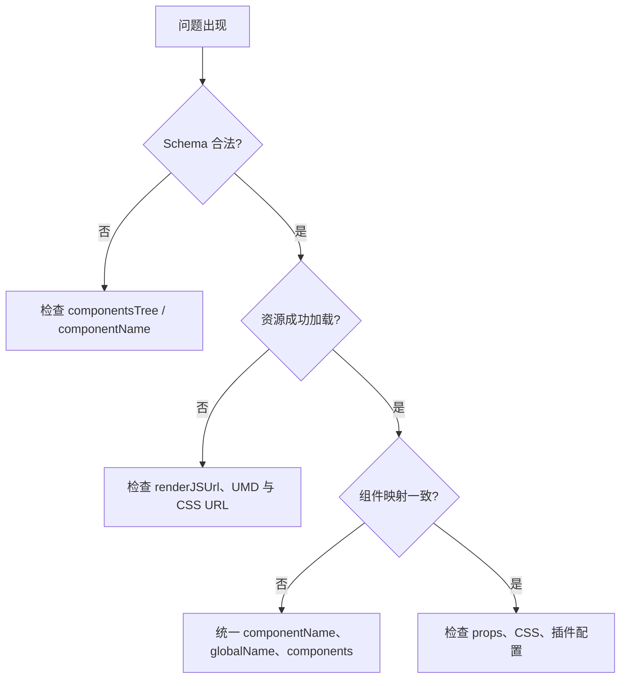

先按“数据 → 资源 → 组件”排查。空白画布、预览缺组件和属性不同步大多可在这三层定位。



## 1. 检查页面协议

打印 `engine.pageModel.export()`，重点确认：

- `componentsTree` 存在，且根节点来自 `EmptyPage` 或 Engine。
- 节点 `componentName` 与物料 Meta 一致。
- 自定义组件的 `componentsMeta`、`assets` 没有在后端持久化时丢失。
- 后端返回的是 JSON 对象，而非二次编码的 JSON 字符串。

## 2. 检查 Engine 上下文

```tsx
<Engine
  {...props}
  onReady={({ engine, pluginManager }) => {
    console.log('page', engine.pageModel.export());
    console.log('plugins', pluginManager);
  }}
/>
```

`onReady` 表示插件已初始化，适合挂载保存、加载和调试功能。需要观察 DOM 挂载时使用 `onMount`。

## 3. 检查 iframe 资源

编辑器画布运行在 iframe。打开浏览器 DevTools 的 Network，检查：

- `renderJSUrl` 返回 200，且指向 UMD 构建。
- `assetPackagesList.resources` 的 JS/CSS URL 对 iframe 可访问。
- 资源包 `globalName` 与 UMD 实际暴露变量一致。
- JS 与 CSS 都加载成功；只加载 JS 时常见表现是组件无样式。

## 4. 检查独立 Render

Render 不会自动从 Engine 取组件。比对 Schema 中的组件名与 `Render` 的 `components` key；先解决映射缺失，再检查业务 props 和样式。

## 5. 最小复现

用 `EmptyPage` + `InnerComponentMeta` 验证 Engine 基础配置，再逐步加入业务物料、资源包和保存的数据。这样可准确分离基础接入、物料资源和业务 Schema 问题。
