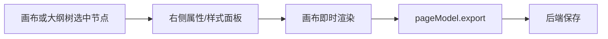

编辑器把页面操作收敛为一条链路：选中节点 → 修改属性或样式 → 查看画布 → 导出 Schema 保存。



## 选择与层级

- **画布选择**：单击元素，直接定位可见节点。
- **大纲树选择**：适合深层节点、重名节点和容器结构确认。
- **容器节点**：只有物料声明 `isContainer` 的组件可以接收子节点；拖入失败先检查目标物料。
- **根节点**：页面根容器是页面协议基础，不能按普通节点删除。

## 编辑属性与样式

右侧属性面板由物料的 `props` 和 setter 生成。优先使用组件显式提供的属性；CSS 面板用于补充样式细节。

| 目标             | 入口           | 说明                                        |
| ---------------- | -------------- | ------------------------------------------- |
| 文本、开关、枚举 | 属性面板       | 可编辑项由物料 setter 决定                  |
| 宽高、边距、定位 | 样式面板       | 使用合法 CSS 值，如 `240px`、`100%`、`auto` |
| 背景、边框、阴影 | 样式面板       | 组件默认样式或父容器样式可能覆盖结果        |
| 响应式样式       | 切换断点后编辑 | 每个断点生成独立 CSS 规则                   |

不要原地修改传入的 `schema` 对象来绕过编辑器。这样会跳过历史记录、插件状态和画布同步；外部数据变更应调用 `engine.updatePage(schema)`。

## 保存页面

`onReady` 在插件完成初始化后执行，适合绑定保存和加载逻辑。

```tsx
<Engine
  {...engineProps}
  onReady={({ engine }) => {
    async function savePage() {
      const schema = engine.pageModel.export();
      await api.save(schema);
    }

    window.addEventListener('save-page', savePage);
  }}
/>
```

只保存 `pageModel.export()` 产生的 JSON。加载已保存页面时，将其作为 `schema` 传入初始 Engine，或调用 `engine.updatePage(schema)`。

## 常见问题

- **尺寸不生效**：检查父容器布局、组件默认样式和 CSS 优先级。
- **拖入失败**：目标节点不是容器，或物料没有声明 `isContainer`。
- **刷新后组件丢失**：Schema、物料 Meta 和运行时组件映射的 `componentName` 不一致。
- **画布没更新**：不要原地改 Schema；调用 `engine.updatePage()`。
