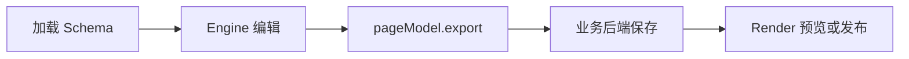

Chameleon 用同一份 PageSchema 驱动编辑器和运行时。完成本页后，你将得到可编辑画布、可保存 JSON，以及独立预览页。



## 前置条件

- React、React DOM 版本不低于 `16.9`。
- 编辑器根容器必须有明确高度。
- 组件资源需可被浏览器 iframe 访问。

## 安装

```bash
pnpm add @chamn/engine @chamn/model @chamn/render
```

业务组件库不是必需依赖。首次接入可先使用 Engine 内置 HTML 物料；需要业务组件时再接入自己的物料包。

## 最小编辑器

```tsx
import { Engine, InnerComponentMeta, plugins } from '@chamn/engine';
import { EmptyPage } from '@chamn/model';
import '@chamn/engine/dist/style.css';

export function PageEditor() {
  return (
    <div style={{ height: '100vh' }}>
      <Engine
        plugins={plugins.DEFAULT_PLUGIN_LIST}
        schema={EmptyPage}
        material={InnerComponentMeta}
        onReady={({ engine }) => console.info('editor ready', engine)}
      />
    </div>
  );
}
```

`DEFAULT_PLUGIN_LIST` 提供设计器、大纲树、组件库、右侧面板、历史记录和快捷键。`InnerComponentMeta` 提供内置 HTML 基础物料；业务组件接入见[添加自定义组件物料](./addCustomComponent)。

## 配置 iframe 渲染器

Engine 的画布在 iframe 内运行。生产构建时，将 `@chamn/render` 的 UMD 文件作为 URL 传入 `renderJSUrl`。Vite 可直接使用 `?url`：

```tsx
import renderJSUrl from '@chamn/render/dist/index.umd.js?url';

<Engine plugins={plugins.DEFAULT_PLUGIN_LIST} schema={schema} material={materials} renderJSUrl={renderJSUrl} />;
```

自定义物料同样需要提供 UMD JS/CSS，并通过 `assetPackagesList` 传入。部署前在 Network 面板确认 iframe 的渲染器和物料资源都返回成功。

## 保存与加载

```tsx
function setupPersistence(engine: Engine) {
  async function save() {
    const schema = engine.pageModel.export();
    await fetch('/api/pages/current', {
      method: 'PUT',
      headers: { 'content-type': 'application/json' },
      body: JSON.stringify(schema),
    });
  }

  async function load() {
    const schema = await fetch('/api/pages/current').then((res) => res.json());
    await engine.updatePage(schema);
  }

  return { save, load };
}
```

只持久化 `pageModel.export()` 的 JSON，不保存 Engine、PageModel、插件或 React 实例。服务端应保留 `componentsTree`、`componentsMeta` 和 `assets`。

## 接入检查

- 已导入 `@chamn/engine/dist/style.css`，且 Engine 容器有高度。
- `schema` 合法；空白页面从 `EmptyPage` 开始。
- 自定义组件的 `componentName` 在 Schema、物料 Meta、UMD 全局对象、Render 映射中一致。
- `renderJSUrl`、物料 UMD JS/CSS 对 iframe 可访问。
- 保存用 `pageModel.export()`；加载用 `schema` 或 `engine.updatePage()`。

## 下一步

- 使用画布：[编辑器基础操作](./editor-basics)
- 排查接入：[调试指南](./debugging)
- 独立运行时：[预览与渲染](./preview-rendering)
- 业务组件接入：[添加自定义组件物料](./addCustomComponent)
