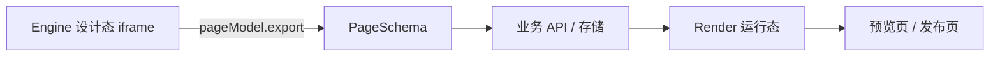

Chameleon 有两条渲染链路：Engine 提供可编辑的设计态画布，Render 在业务页面中显示已保存的 Schema。两者共享页面协议，但职责不同。

| 场景           | 使用     | 输入                      | 输出                     |
| -------------- | -------- | ------------------------- | ------------------------ |
| 编辑过程预览   | `Engine` | `schema`、物料、资源包    | 可选择、拖拽、配置的画布 |
| 用户预览或发布 | `Render` | 保存后的 `page`、组件映射 | 普通 React 组件树        |



## Engine 内预览

Engine 的预览能力用于编辑过程中的快速确认；它仍依赖画布 iframe 的 `renderJSUrl` 和物料资源。可通过 `engine.preview()`、`engine.exitPreview()` 等 API 管理预览状态。它不应替代真实的业务预览页。

## 独立预览页

独立页面直接使用 `@chamn/render`。每个 Schema 节点的 `componentName` 必须能在 `components` 映射中找到 React 组件。

```tsx
import { Render, ReactAdapter } from '@chamn/render';
import { Button, Card } from './components';

export function PagePreview({ page }: { page: CPageDataType }) {
  return (
    <Render page={page} adapter={ReactAdapter} components={{ Button, Card }} pageProps={{ user: { name: 'Ada' } }} />
  );
}
```

资源动态加载、`useRender` 与 UMD 方式见 [Render 使用指南](./useRender)。

## 发布前验证

- 从后端读取真实保存的 Schema，不使用编辑器内存对象。
- 检查所有 `componentName` 都存在于 `components` 映射。
- 外部组件库需要同时加载 JS 与 CSS。
- `pageProps`、全局状态和请求适配要满足页面表达式、生命周期需求。
