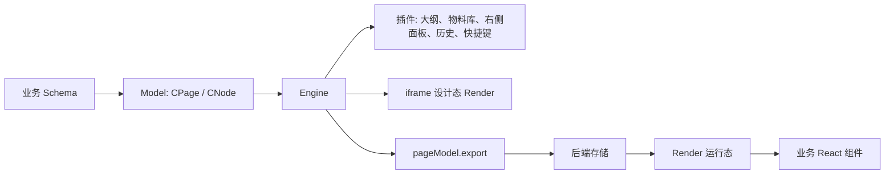

## 包职责

| 包                | 责任                                     | 业务接入点                              |
| ----------------- | ---------------------------------------- | --------------------------------------- |
| `@chamn/model`    | Schema 类型、`CPage`、节点模型、物料类型 | 保存与加载页面 JSON                     |
| `@chamn/engine`   | 工作台、插件、属性面板、设计态画布       | `<Engine />`、`onReady`、插件配置       |
| `@chamn/layout`   | iframe 布局、选中、拖拽、缩放、尺寸调整  | Engine 内部使用；高级画布定制可直接使用 |
| `@chamn/render`   | Schema 到 React 组件树的运行时渲染       | 预览页、发布页                          |
| `@chamn/material` | 示例和基础物料实现                       | 参考物料组织方式                        |

## 运行链路

Engine 负责编辑器交互；真正决定页面视觉的是 Schema、同名 React 组件和组件 CSS。编辑器画布与独立预览页需要兼容的组件实现。

## 默认插件

`plugins.DEFAULT_PLUGIN_LIST` 包含：设计器、运行时日志、大纲树、组件库、全局状态面板、右侧面板、历史记录和快捷键。

最小自定义插件列表仍应包含 `DesignerPlugin`；缺少它会失去可编辑画布。想保留撤销和键盘操作时，同时保留 `HistoryPlugin`、`HotkeysPlugin`。

## 设计态与运行态

- **设计态**：Engine 将 Render 放进 iframe，并添加选择、拖拽、尺寸调整和属性面板。
- **运行态**：Render 直接输出组件树，不包含编辑器 UI；通过 `pageProps`、`$$context` 或请求适配连接业务数据。
- **共享边界**：Schema 是唯一跨端契约。不要持久化 Engine 实例、插件状态或 DOM 引用。

## 扩展边界

- 新业务组件：React 组件 + 物料 Meta + 编辑器可加载资源。
- 新属性编辑器：注册 custom setter，再在物料 `props` 中使用。
- 新工作台能力：新增插件或通过 Workbench API 替换面板视图。
- 新发布能力：使用 Render 和业务自己的组件映射、鉴权、数据接口。
