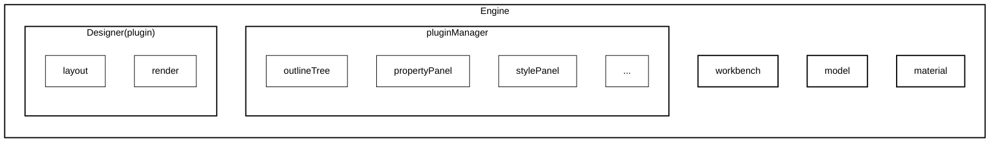

import { Tabs, TabItem } from '@astrojs/starlight/components';

# Engine 介绍

`@chamn/engine` 是 Chameleon 可视化编程引擎的核心包，提供了一个完整的低代码编辑器解决方案。它基于 React 构建，提供了丰富的 API 和插件系统，让你可以快速构建自己的可视化页面编辑器。

## 核心特性

- 🎨 **可视化编辑**: 通过拖拽的方式快速构建页面
- 🔌 **插件化架构**: 灵活的插件系统，支持自定义扩展
- 📦 **物料管理**: 完善的组件物料管理机制
- 🎯 **实时预览**: 支持实时预览和编辑模式切换
- 🌐 **国际化支持**: 内置国际化能力
- 🎛️ **工作台定制**: 可自定义的工作台布局和组件

## 安装

<Tabs>
  <TabItem label="npm">```shell npm i @chamn/engine @chamn/model @chamn/render ```</TabItem>
  <TabItem label="pnpm">```shell pnpm i @chamn/engine @chamn/model @chamn/render ```</TabItem>
  <TabItem label="yarn">```shell yarn i @chamn/engine @chamn/model @chamn/render ```</TabItem>
</Tabs>

## 快速开始

最简单的使用方式：

```tsx
import { Engine, plugins } from '@chamn/engine';
import '@chamn/engine/dist/style.css';

const { DEFAULT_PLUGIN_LIST } = plugins;

function App() {
  return (
    <Engine
      plugins={DEFAULT_PLUGIN_LIST}
      schema={pageSchema}
      material={materials}
      onReady={(ctx) => {
        console.log('Engine ready!', ctx);
      }}
    />
  );
}
```

## 引擎架构

Chameleon Engine 采用分层架构设计，各模块之间通过清晰的依赖关系组织。以下是引擎的核心架构图：



### 模块说明

#### Engine（核心容器）

- **职责**: 整个编辑器的核心容器，管理所有子模块
- **功能**:
  - 初始化和管理插件系统
  - 管理页面模型和物料数据
  - 提供统一的事件通信机制
  - 协调各模块之间的交互

#### PluginManager（插件管理器）

- **职责**: 管理所有插件的生命周期
- **功能**:
  - 插件的注册、初始化、销毁
  - 插件之间的通信协调
  - 插件配置管理
  - 插件依赖关系处理
- **依赖**: Engine、Model、Layout、Material

#### Model（页面模型）

- **职责**: 管理页面数据结构
- **功能**:
  - 页面节点的增删改查
  - 节点状态管理
  - 数据变更通知
  - 页面数据序列化/反序列化
- **被依赖**: PluginManager、Render、各插件

#### Material（物料系统）

- **职责**: 管理组件物料信息
- **功能**:
  - 组件元数据管理（组件配置、属性定义等）
  - 资源包管理（组件运行时资源）
  - 组件与资源的关联
- **被依赖**: Engine、PluginManager、Render

#### Layout（工作台布局）

- **职责**: 提供编辑器 UI 布局框架
- **功能**:
  - 左侧面板管理（组件库等）
  - 中间画布区域
  - 右侧面板管理（属性面板等）
  - 顶部工具栏
  - 布局可定制化
- **被依赖**: PluginManager、各插件

#### Render（渲染器）

- **职责**: 将页面模型渲染为可视化界面
- **功能**:
  - 设计时渲染（可编辑模式）
  - 预览渲染（只读模式）
  - 组件实例化
  - 事件处理
- **被依赖**: Designer 插件、Canvas
- **依赖**: Model、Material

## 核心概念

### Engine 组件

`Engine` 是一个 React 类组件，是整个编辑器的核心容器。它管理着页面模型、插件系统、物料库等核心功能。

### 插件系统

Engine 采用插件化架构，所有功能都通过插件实现。内置了多个常用插件：

- `Designer`: 设计器画布
- `ComponentLibrary`: 组件库面板
- `OutlineTree`: 页面结构树
- `PropertyPanel`: 属性面板
- `History`: 历史记录管理
- 等等...

### 页面模型 (PageModel)

Engine 内部使用 `CPage` 来管理页面数据，提供了完整的页面节点操作能力。

### 物料系统

物料系统包括组件描述（Material）和组件库（AssetPackage），通过 `componentName` 进行关联。

## 与阿里 LowCode Engine 对比

Chameleon Engine 和阿里 LowCode Engine 都是优秀的低代码解决方案，但在设计理念和使用场景上有所不同：

### 架构设计

| 特性         | Chameleon Engine         | 阿里 LowCode Engine          |
| :----------- | :----------------------- | :--------------------------- |
| **架构模式** | 插件化架构，高度可扩展   | 一体化架构，功能完整         |
| **包体积**   | 轻量级，按需加载         | 体积较大，功能齐全           |
| **定制性**   | 高度可定制，可完全自定义 | 定制性有限，主要面向企业场景 |
| **学习曲线** | 简单直观，易于上手       | 功能丰富，学习成本较高       |

### 核心优势

#### Chameleon Engine 的优势

✅ **轻量灵活**

- 核心包体积小，按需加载插件
- 可以只使用需要的功能模块
- 适合中小型项目和快速原型开发

✅ **高度可定制**

- 插件化架构，所有功能都可通过插件扩展
- 工作台布局完全可定制
- 可以完全按照业务需求定制编辑器

✅ **简单易用**

- API 设计简洁直观
- 文档清晰，上手快速
- 适合快速集成到现有项目

✅ **开源免费**

- Apache License 2.0 协议，完全开源
- 社区活跃，持续更新
- 无商业限制

✅ **技术栈友好**

- 基于 React，与现有 React 生态无缝集成
- 支持 TypeScript
- 使用现代前端技术栈

#### 阿里 LowCode Engine 的优势

✅ **企业级功能**

- 功能完整，开箱即用
- 与阿里云生态深度集成
- 适合大型企业级应用

✅ **商业支持**

- 提供商业技术支持
- 有专业的团队维护
- 适合对稳定性要求极高的项目

✅ **功能丰富**

- 内置大量企业级组件和模板
- 提供完整的解决方案
- 适合快速构建企业应用

### 适用场景

#### Chameleon Engine 适合：

- 🎯 需要高度定制的编辑器场景
- 🎯 中小型项目和快速原型开发
- 🎯 希望完全控制编辑器行为的团队
- 🎯 需要轻量级解决方案的项目
- 🎯 开源项目或需要开源协议的项目

#### 阿里 LowCode Engine 适合：

- 🎯 大型企业级应用开发
- 🎯 需要快速上线，对定制要求不高的场景
- 🎯 需要商业技术支持的团队
- 🎯 与阿里云生态深度集成的项目

### 总结

Chameleon Engine 更适合追求**灵活性、可定制性和轻量级**的团队，而阿里 LowCode Engine 更适合需要**完整解决方案和商业支持**的企业级项目。选择哪个引擎主要取决于你的项目需求、团队规模和技术栈偏好。

如果你需要：

- **完全控制编辑器的行为** → 选择 Chameleon Engine
- **快速集成，开箱即用** → 可以考虑阿里 LowCode Engine
- **轻量级解决方案** → 选择 Chameleon Engine
- **企业级支持和保障** → 可以考虑阿里 LowCode Engine

## 下一步

- 查看 [API 文档](./api/) 了解详细的 API 使用
- 查看 [使用示例](./usage/) 学习更多用法
- 查看 [插件开发](../plugin/plugin-develop/) 了解如何开发自定义插件
