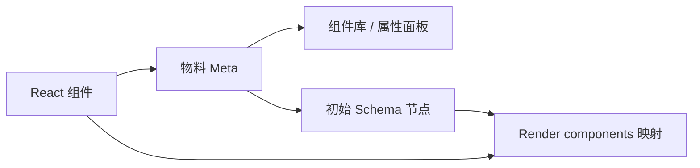

物料是业务 React 组件的“编辑器说明书”。React 组件负责运行时渲染；物料 Meta 决定组件如何出现在组件库、哪些属性可编辑、能否容纳子节点，以及事件和方法怎样暴露。

## 物料组成

| 字段                          | 用途                                       |
| ----------------------------- | ------------------------------------------ |
| `componentName`               | 唯一组件名；必须与 Schema、Render 映射一致 |
| `title` / `category` / `tags` | 组件库展示、分类、搜索                     |
| `snippets`                    | 拖入画布时创建的初始节点                   |
| `props`                       | 右侧属性面板生成的可编辑字段与 setter      |
| `isContainer`                 | 是否可接收子节点                           |
| `events` / `methods`          | 事件流、方法调用等高级能力                 |
| `npm` / `advanceCustom`       | 资源定位和高级编辑行为                     |



## 最小物料

```ts
import type { CMaterialType } from '@chamn/model';

export const NoticeMeta: CMaterialType = {
  componentName: 'Notice',
  title: '提示条',
  category: '反馈',
  snippets: [{ componentName: 'Notice', props: { message: '提示内容' } }],
  props: [
    {
      name: 'message',
      title: '内容',
      valueType: 'string',
      defaultValue: '提示内容',
      setters: ['TextAreaSetter'],
    },
  ],
};
```

这只描述编辑器。预览页还需要 `components={{ Notice }}`；Engine 设计态还需要通过 `assetPackagesList` 让 iframe 加载同一组件实现。

## 开发顺序

1. 固化 `componentName`，避免后续重命名导致历史 Schema 失效。
2. 写最小 `snippets`、`props`，先让组件可拖入、可配置。
3. 容器组件补 `isContainer`；交互组件补事件和方法。
4. 产出 Meta、UMD JS/CSS，同时验证 Engine 和 Render。

继续阅读：[物料开发](./developMaterial)、[物料协议](../PageSchema/material)。
