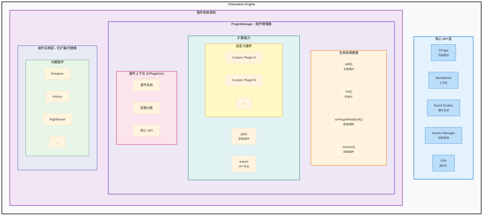
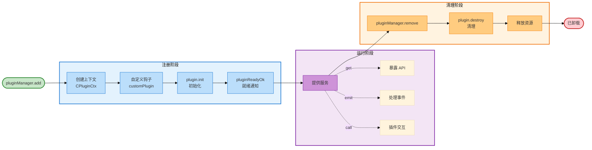

---
sidebar:
  order: 1
title: 插件开发指南
---

# 插件开发指南

Chameleon Engine 采用插件化架构，所有功能都可以通过插件扩展。本文档将详细介绍如何开发自定义插件。

## 插件架构总览



### 架构说明

上图展示了 Chameleon Engine 的插件系统架构，核心理念是**完全插件化**和**高度可扩展**。

#### 1. 核心 API 层

引擎提供了一组稳定的核心 API，供插件访问和操作：

- **CPage**：页面模型，管理节点树结构，提供节点增删改查能力
- **Workbench**：工作台容器，管理面板、视图的布局和交互
- **Event Emitter**：事件总线，实现模块间的松耦合通信
- **Assets Manager**：资源包管理器，统一管理组件资源
- **I18n**：国际化支持，提供多语言能力

#### 2. PluginManager - 插件管理器

PluginManager 是插件系统的核心，负责插件的全生命周期管理和扩展能力：

**生命周期管理**：

- `add(plugin)`：注册插件到系统
- `init(ctx)`：初始化插件，注入上下文
- `onPluginReadyOk(name)`：等待插件就绪，支持异步依赖
- `remove(name)`：卸载插件，清理资源

**扩展能力**：

- `get(name)`：获取插件实例，访问插件暴露的 API
- `customPlugin(name, hook)`：定制插件配置，实现插件的可替换性
- `export`：插件通过 export 暴露 API，供其他插件或外部调用

**插件上下文 (CPluginCtx)**：

- 每个插件都拥有独立的上下文对象
- 包含全局事件系统和插件私有事件系统
- 可访问所有核心 API
- 支持自定义配置对象

#### 3. 插件实例层 - 可扩展/可替换

**内置插件**：

- 提供开箱即用的核心功能
- 可被自定义插件完全替换
- 包括：Designer（设计器）、History（历史记录）、RightPanel（属性面板）等

**自定义插件**：

- 完全自由的插件开发
- 可替换任何内置插件
- 可扩展新功能
- 与内置插件享有相同的 API 访问权限

### 插件系统的核心特性

#### 可扩展性

- **无限扩展**：通过 `pluginManager.add()` 可以添加任意数量的插件
- **平等访问**：自定义插件与内置插件拥有相同的核心 API 访问权限
- **独立上下文**：每个插件拥有独立的配置和事件系统

#### 可替换性

- **插件定制**：通过 `customPlugin()` 可以在插件初始化前修改其配置
- **完全替换**：移除内置插件，添加自定义插件即可实现功能替换
- **热插拔**：支持运行时动态添加和移除插件

#### 松耦合

- **事件驱动**：插件间通过事件系统通信，避免直接依赖
- **API 导出**：插件通过 `export` 暴露标准 API，降低耦合度
- **上下文隔离**：每个插件的状态和配置相互独立

### 插件生命周期



**生命周期详解**：

1. **注册阶段**（PluginRegistration）

   - `pluginManager.add(plugin)`：注册插件到系统
   - 创建插件上下文（CPluginCtx）：包含核心 API、事件系统、配置对象
   - 执行自定义钩子（customPluginHooks）：可在初始化前修改插件配置
   - 调用 `plugin.init(ctx)`：执行插件初始化逻辑
   - 触发 `pluginReadyOk()`：通知系统插件已准备就绪

2. **运行阶段**（Running）

   - 插件可被其他插件通过 `pluginManager.get(name)` 获取
   - 通过 `export` 暴露 API 供外部调用
   - 监听和处理事件
   - 与其他插件进行交互

3. **清理阶段**（Cleanup）
   - `pluginManager.remove(name)`：触发卸载流程
   - 调用 `plugin.destroy(ctx)`：执行清理逻辑
   - 注销事件监听，避免内存泄漏
   - 清理 UI 组件和释放资源

## 插件定义

插件可以是一个对象，也可以是一个返回插件定义的函数：

```typescript
export type PluginObj<C, E = any> = {
  /** 插件名称（必需，必须唯一） */
  name: string;
  /** 插件静态名称（可选，用于类型安全访问） */
  PLUGIN_NAME?: string;
  /** 初始化方法（必需） */
  init: (ctx: CPluginCtx<C>) => Promise<void>;
  /** 销毁方法（必需） */
  destroy: (ctx: CPluginCtx<C>) => Promise<void>;
  /** 重载方法（可选） */
  reload?: (ctx: CPluginCtx<C>) => Promise<void>;
  /** 导出 API（必需） */
  export: (ctx: CPluginCtx<C>) => E;
  /** 元数据（必需） */
  meta: {
    engine: {
      version: string;
    };
  };
};

export type CPlugin<C = any, E = any> = PluginObj<C, E> | ((ctx: CPluginCtx<C>) => PluginObj<C, E>);
```

### 插件上下文 (CPluginCtx)

插件上下文提供了访问引擎核心功能的能力：

```typescript
type CPluginCtx<C = any> = {
  name?: string; // 插件名称
  globalEmitter: Emitter<any>; // 全局事件发射器
  emitter: Emitter<any>; // 插件私有事件发射器
  config: C; // 插件配置对象
  getWorkbench: () => Workbench; // 获取工作台实例
  pluginManager: PluginManager; // 插件管理器
  pageModel: CPage; // 页面模型
  i18n: CustomI18n; // 国际化对象
  assetsPackageListManager: AssetsPackageListManager; // 资源包管理器
  engine: Engine; // 引擎实例
  pluginReadyOk: () => void; // 通知插件已准备好
};
```

## 快速开始

### 创建一个简单的插件

```typescript
import { CPlugin } from '@chamn/engine';

const PLUGIN_NAME = 'HelloPlugin' as const;

export const HelloPlugin: CPlugin = (ctx) => {
  return {
    name: PLUGIN_NAME,
    PLUGIN_NAME,

    async init(ctx) {
      console.log('Hello Plugin 初始化！');

      // 添加左侧面板
      const workbench = ctx.getWorkbench();
      workbench.addLeftPanel({
        name: PLUGIN_NAME,
        title: 'Hello',
        icon: <span>👋</span>,
        view: <div>Hello World!</div>,
      });

      // 通知插件已准备好（重要！）
      ctx.pluginReadyOk();
    },

    async destroy(ctx) {
      console.log('Hello Plugin 销毁');
    },

    export: (ctx) => {
      return {
        sayHello() {
          console.log('Hello from plugin!');
        },
      };
    },

    meta: {
      engine: {
        version: '1.0.0',
      },
    },
  };
};

// 添加静态属性（推荐）
HelloPlugin.PLUGIN_NAME = PLUGIN_NAME;
```

### 使用插件

```tsx
import { Engine, plugins } from '@chamn/engine';
import { HelloPlugin } from './HelloPlugin';

const { DEFAULT_PLUGIN_LIST } = plugins;

function App() {
  const onReady = async (ctx) => {
    // 获取插件实例
    const helloPlugin = await ctx.pluginManager.get('HelloPlugin');

    // 调用插件方法
    helloPlugin?.export.sayHello();
  };

  return (
    <Engine
      plugins={[...DEFAULT_PLUGIN_LIST, HelloPlugin]}
      schema={pageSchema}
      material={materials}
      onReady={onReady}
    />
  );
}
```

## 实战示例

### 示例 1: 历史记录插件

完整的历史记录插件实现，支持撤销/重做功能：

```typescript
import { waitReactUpdate } from '@/utils';
import { CPageDataType } from '@chamn/model';
import { cloneDeep, debounce } from 'lodash-es';
import { CPlugin, CPluginCtx } from '@chamn/engine';

const PLUGIN_NAME = 'History' as const;

export type HistoryExport = {
  addStep: () => void;
  reset: () => Promise<void>;
  preStep: () => void;
  nextStep: () => void;
  canGoPreStep: () => boolean;
  canGoNextStep: () => boolean;
};

export const HistoryPlugin: CPlugin<any, HistoryExport> = (ctx) => {
  const CTX: CPluginCtx | null = ctx;
  const dataStore = {
    historyRecords: [] as CPageDataType[],
    currentStepIndex: 0,
  };

  let originalPageRecord: CPageDataType | null = null;
  const pageSchema = ctx.pageModel.export();
  originalPageRecord = pageSchema;
  dataStore.historyRecords.push(pageSchema);

  const loadPage = async (page: CPageDataType) => {
    if (!CTX) {
      return;
    }
    CTX.pageModel.reloadPage(page);
    await waitReactUpdate();
  };

  const resObj = {
    addStep: () => {
      const { currentStepIndex, historyRecords } = dataStore;
      const newPage = ctx.pageModel.export();
      if (currentStepIndex !== historyRecords.length - 1) {
        dataStore.historyRecords = historyRecords.slice(0, currentStepIndex + 1);
      }
      dataStore.historyRecords.push(newPage);
      dataStore.currentStepIndex = historyRecords.length - 1;
    },
    reset: async () => {
      const ctx = CTX;
      if (!ctx) {
        console.warn('plugin ctx is null, pls check it');
        return;
      }
      if (!originalPageRecord) {
        return;
      }
      dataStore.historyRecords = [];
      loadPage(originalPageRecord);
    },
    preStep: () => {
      const { currentStepIndex, historyRecords } = dataStore;
      if (!resObj.canGoPreStep()) {
        return;
      }
      const newIndex = currentStepIndex - 1;
      dataStore.currentStepIndex = newIndex;
      const page = cloneDeep(historyRecords[newIndex]);
      loadPage(page);
    },
    nextStep: () => {
      if (!resObj.canGoNextStep()) {
        return;
      }
      const { currentStepIndex, historyRecords } = dataStore;
      const newIndex = currentStepIndex + 1;
      dataStore.currentStepIndex = newIndex;
      const page = cloneDeep(historyRecords[newIndex]);
      return loadPage(page);
    },
    canGoPreStep: () => {
      const { currentStepIndex } = dataStore;
      if (currentStepIndex <= 0) {
        return false;
      }
      return true;
    },
    canGoNextStep: () => {
      const { currentStepIndex, historyRecords } = dataStore;
      if (currentStepIndex >= historyRecords.length - 1) {
        return false;
      }
      return true;
    },
  };

  // 防抖处理，避免频繁记录
  const debounceAddStep = debounce(() => {
    resObj.addStep();
  }, 500);

  return {
    name: PLUGIN_NAME,
    PLUGIN_NAME,
    async init(ctx) {
      // 监听节点变化
      ctx.pageModel.emitter.on('onNodeChange', () => {
        debounceAddStep();
      });

      // 监听页面变化
      ctx.pageModel.emitter.on('onPageChange', () => {
        resObj.addStep();
      });

      // !!! 必须调用，通知 engine，插件初始化完成，可以被消费
      ctx.pluginReadyOk();
    },
    async destroy(ctx) {
      console.log('destroy', ctx);
    },
    // 提供给其他插件或者外部使用的方法
    export: () => {
      return resObj;
    },
    // 插件元信息，引擎的最低版本要求
    meta: {
      engine: {
        version: '1.0.0',
      },
    },
  };
};

HistoryPlugin.PLUGIN_NAME = PLUGIN_NAME;
```

### 示例 2: 自定义面板插件

```typescript
import React, { useState } from 'react';
import { CPlugin } from '@chamn/engine';
import { Button, Input } from 'antd';

const PLUGIN_NAME = 'CustomPanel' as const;

// 面板视图组件
const CustomPanelView: React.FC<{ pluginCtx: any }> = ({ pluginCtx }) => {
  const [text, setText] = useState('');

  return (
    <div style={{ padding: '20px' }}>
      <h3>自定义面板</h3>
      <Input placeholder="输入文本" value={text} onChange={(e) => setText(e.target.value)} />
      <Button
        style={{ marginTop: '10px' }}
        onClick={() => {
          console.log('输入的文本:', text);
        }}
      >
        提交
      </Button>
    </div>
  );
};

export const CustomPanelPlugin: CPlugin = (ctx) => {
  return {
    name: PLUGIN_NAME,
    PLUGIN_NAME,

    async init(ctx) {
      const workbench = ctx.getWorkbench();

      // 添加左侧面板
      workbench.addLeftPanel({
        name: PLUGIN_NAME,
        title: '自定义面板',
        icon: <span>📝</span>,
        view: <CustomPanelView pluginCtx={ctx} />,
      });

      ctx.pluginReadyOk();
    },

    async destroy(ctx) {
      console.log('清理插件');
    },

    export: (ctx) => ({}),

    meta: {
      engine: { version: '1.0.0' },
    },
  };
};

CustomPanelPlugin.PLUGIN_NAME = PLUGIN_NAME;
```

### 示例 3: 自定义工具栏插件

```typescript
import React from 'react';
import { CPlugin } from '@chamn/engine';
import { Button, Space } from 'antd';

const PLUGIN_NAME = 'CustomToolbar' as const;

export const CustomToolbarPlugin: CPlugin = (ctx) => {
  return {
    name: PLUGIN_NAME,
    PLUGIN_NAME,

    async init(ctx) {
      const workbench = ctx.getWorkbench();
      const engine = ctx.engine;

      // 自定义顶部工具栏
      workbench.replaceTopBarView(
        <div
          style={{
            width: '100%',
            height: '100%',
            display: 'flex',
            alignItems: 'center',
            justifyContent: 'space-between',
            padding: '0 20px',
          }}
        >
          <div style={{ fontSize: '18px', fontWeight: 'bold' }}>我的编辑器</div>

          <Space>
            <Button onClick={() => engine.preview()}>预览</Button>
            <Button onClick={() => engine.existPreview()}>编辑</Button>
            <Button onClick={() => engine.refresh()}>刷新</Button>
            <Button
              type="primary"
              onClick={() => {
                const pageData = engine.pageModel.export();
                localStorage.setItem('page', JSON.stringify(pageData));
              }}
            >
              保存
            </Button>
          </Space>
        </div>
      );

      ctx.pluginReadyOk();
    },

    async destroy(ctx) {},
    export: (ctx) => ({}),
    meta: { engine: { version: '1.0.0' } },
  };
};

CustomToolbarPlugin.PLUGIN_NAME = PLUGIN_NAME;
```

## 加载插件

```tsx
import { Engine, EnginContext, plugins } from '@chamn/engine';
import { HistoryPlugin } from './HistoryPlugin';
import { CustomPanelPlugin } from './CustomPanelPlugin';

const { DEFAULT_PLUGIN_LIST } = plugins;

export const App = () => {
  const onReady = useCallback(async (ctx: EnginContext) => {
    // 等待插件准备完成
    const designer = await ctx.pluginManager.onPluginReadyOk('Designer');
    const history = await ctx.pluginManager.onPluginReadyOk('History');

    // 获取工作台
    const workbench = ctx.engine.getWorkbench();

    // 使用插件导出的方法
    history?.export.preStep();
  }, []);

  return (
    <Engine
      // 加载插件
      plugins={[...DEFAULT_PLUGIN_LIST, HistoryPlugin, CustomPanelPlugin]}
      schema={pageSchema}
      material={materials}
      onReady={onReady}
    />
  );
};
```

## 插件配置

通过 `beforePluginRun` 自定义插件配置：

```tsx
import { Engine, plugins } from '@chamn/engine';

const beforePluginRun = ({ pluginManager }) => {
  // 自定义插件配置
  pluginManager.customPlugin('MyPlugin', (pluginInstance) => {
    // 修改插件配置
    pluginInstance.ctx.config.customOption = 'value';

    return pluginInstance;
  });
};

<Engine
  beforePluginRun={beforePluginRun}
  plugins={plugins}
  // ...
/>;
```

## 最佳实践

### 1. 使用 TypeScript

```typescript
import { CPlugin, CPluginCtx } from '@chamn/engine';

// 定义配置类型
type MyPluginConfig = {
  enabled: boolean;
  option1: string;
};

// 定义导出类型
type MyPluginExport = {
  doSomething: () => void;
};

// 使用泛型
export const MyPlugin: CPlugin<MyPluginConfig, MyPluginExport> = (ctx) => {
  return {
    name: 'MyPlugin',

    async init(ctx) {
      // 类型安全的配置访问
      const enabled = ctx.config.enabled;

      ctx.pluginReadyOk();
    },

    async destroy(ctx) {},

    export: (ctx) => {
      return {
        doSomething() {
          console.log('Do something');
        },
      };
    },

    meta: { engine: { version: '1.0.0' } },
  };
};
```

### 2. 命名规范

- 插件命名统一采用 `PascalCase`，如 `MyPlugin`
- 插件名称常量使用 `PLUGIN_NAME`
- 导出的插件对象添加静态属性 `PLUGIN_NAME`

### 3. 错误处理

```typescript
export const SafePlugin: CPlugin = (ctx) => {
  return {
    name: 'SafePlugin',

    async init(ctx) {
      try {
        // 可能出错的操作
        const data = await fetchData();

        // 验证依赖
        const workbench = ctx.getWorkbench();
        if (!workbench) {
          throw new Error('工作台未初始化');
        }

        ctx.pluginReadyOk();
      } catch (error) {
        console.error('插件初始化失败:', error);
        ctx.pluginReadyOk(); // 即使失败也通知
      }
    },

    async destroy(ctx) {},
    export: (ctx) => ({}),
    meta: { engine: { version: '1.0.0' } },
  };
};
```

### 4. 内存管理

```typescript
export const MemoryAwarePlugin: CPlugin = (ctx) => {
  const disposables: (() => void)[] = [];

  return {
    name: 'MemoryAwarePlugin',

    async init(ctx) {
      // 监听事件
      const handler = () => {
        /* ... */
      };
      ctx.globalEmitter.on('event', handler);

      // 记录清理函数
      disposables.push(() => {
        ctx.globalEmitter.off('event', handler);
      });

      ctx.pluginReadyOk();
    },

    async destroy(ctx) {
      // 执行所有清理函数
      disposables.forEach((dispose) => dispose());
      disposables.length = 0;
    },

    export: (ctx) => ({}),
    meta: { engine: { version: '1.0.0' } },
  };
};
```

## 常见问题

### Q: 插件何时初始化？

A: 插件在 Engine 组件 `componentDidMount` 时初始化，按照插件列表的顺序依次执行 `init` 方法。

### Q: 如何确保插件初始化完成？

A: 使用 `ctx.pluginReadyOk()` 通知插件管理器插件已准备好。其他插件可以通过 `ctx.pluginManager.onPluginReadyOk('PluginName')` 等待。

### Q: 插件可以访问其他插件吗？

A: 可以。使用 `ctx.pluginManager.get('PluginName')` 获取其他插件实例。

## 参考资源

- [内置插件列表](../innder-plugin-list/) - 查看所有内置插件
- [内置插件使用指南](../built-in-plugins-usage/) - 学习内置插件的用法
- [Engine API](../../engine/api/) - 了解 Engine 的 API
- [示例项目](https://github.com/ByteCrazy/chameleon-demo) - 查看完整示例
